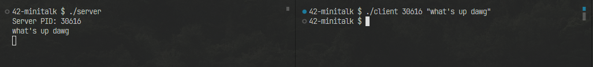

## minitalk

[Click here for subject file](./docs/en.subject.pdf)  
Handling signals between two processes using UNIX signals.

#### Setting up

1. Run `make` to compile the server and client executables.

2. Run `./server` to start the server.

3. Run `./client [server-pid] [message]`, replacing `[server-pid]` with the server's PID to send a message to the server.

#### Some takeaways

1. In UNIX, bit manipulation is essential for handling signals.

2. Welp, this project is relatively simple.
